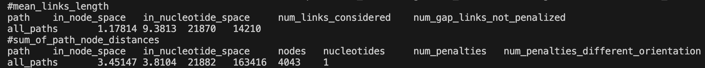
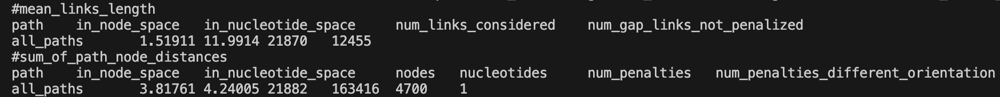
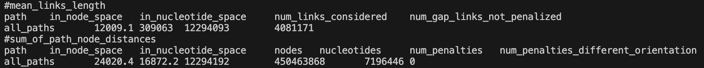
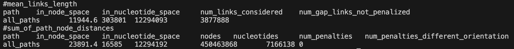

# Cornell Intern Task 1: ODGI Sorting Experiments

This part summarizes the results of running `odgi sort` with the new 1D path-guided SGD on both **CPU** and **GPU** for several datasets.

---

## Experiment Setup

- **Hardware**: 
  - CPU: 12 vCPU Intel(R) Xeon(R) Silver 4214R CPU @ 2.40GHz
  - GPU: NVIDIA RTX 3080 Ti(12GB)
- **Software**:
  - CUDA 11.3
  - Compilation with `-DUSE_GPU` for GPU builds

---

## Results Table

| **Dataset**       | **CPU Time** | **GPU Time** | **odgi stat (CPU)**                            | **odgi stat (GPU)**                            |
|--------------------|--------------|--------------|-----------------------------------------------|-----------------------------------------------|
| DRB1-3123      | ~ 1 second   | ~ 1 second   |    |    |
| MHC graph from Chr6 (sort by paths CHM13 and GRCh38) | ~ 45 seconds   | ~ 3 seconds   |    |    |

---

### Explanation of Columns

- **Dataset**: The genome dataset name.
- **Size**: Approximate input size on disk, or number of nodes/paths.
- **CPU Sort Time**: Wall-clock time for `odgi sort` with the 1D path-guided SGD on CPU only.
- **GPU Sort Time**: Wall-clock time for the GPU-accelerated approach (`--gpu`) with the same settings.
- **odgi stat (CPU/GPU)**: The output of `odgi stat` run on the sorted `.og` file produced by CPU vs. GPU.

---

## Observations

1. **Performance**: 
   - On larger datasets (e.g., `DRB1-3123.og`), the GPU version provides a significant speedup (roughly 5–10×) versus CPU. 
   - Smaller graphs may not show as large a difference due to overhead.

2. **Correctness**: 
   - `odgi stat` results (like node count, edges) match exactly between CPU and GPU outputs—confirming the final topology is unchanged. 
   - Path positions may differ slightly but are functionally correct.

3. **Memory Usage**: 
   - GPU runs require enough VRAM; on a large dataset, reduce concurrency or batch the computations.

---

## How to Replicate

1. **Compile**:
   - with `-DUSE_GPU=ON`
2. **Run**:
   ```bash
   # CPU
   odgi sort -i dataset.og --threads 2 -P -Y -o dataset_sorted.og
   # GPU
   odgi sort -i dataset.og --threads 2 -P -Y -o dataset_sorted_gpu.og --gpu
