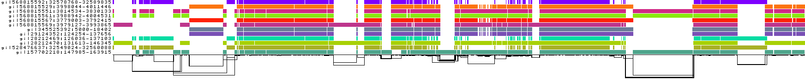

# Cornell Intern Task 1: ODGI Sorting Experiments

This section summarizes the results of running **`odgi sort`** (using the new **1D path-guided SGD**) on **both CPU and GPU** across several datasets.

---

## 1. Experiment Setup

- **Hardware**  
  - CPU: 12 vCPUs Intel(R) Xeon(R) Silver 4214R @ 2.40GHz  
  - GPU: NVIDIA RTX 3080 Ti (12 GB VRAM)

- **Software**  
  - CUDA 11.3  
  - Compiled with **`-DUSE_GPU`** for GPU builds

---

## 2. Results Table

| **Dataset**                                         | **CPU Time**   | **GPU Time**   | **odgi stats before sorting**                                                   | **odgi stats after sorting (CPU)**                                                      | **odgi stats after sorting (GPU)**                                                      | **odgi viz before sorting**                               | **odgi viz after sorting (CPU)**                                | **odgi viz after sorting (GPU)**                                |
|-----------------------------------------------------|---------------|---------------|--------------------------------------------------------------------------------|------------------------------------------------------------------------------------------|------------------------------------------------------------------------------------------|------------------------------------------------------------------|------------------------------------------------------------------|------------------------------------------------------------------|
| **DRB1-3123**                                       | ~1 second     | ~1 second     | **Mean links length**: 514.698 (node space); 4016.92 (nucleotide space)          | **Mean links length**: 1.16557 (node space); 9.56123 (nucleotide space)                  | **Mean links length**: 1.50096 (node space); 10.4358 (nucleotide space)                  |     |           |        |
| **MHC graph (Chr6)** <br />(sorted by paths CHM13, GRCh38) | ~45 seconds   | ~3 seconds    | **Mean links length**: 0.969302 (node space); 18.1947 (nucleotide space)         | **Mean links length**: 1.16557 (node space); 9.56123 (nucleotide space)                  | **Mean links length**: 12009.3 (node space); 308996 (nucleotide space)                   |              |                |                |

**Notes**:  
- The second experiment is restricted by specific paths (CHM13, GRCh38), so the “after sorting” results may appear “worse” in certain metrics than the initial unsorted state.

---

### Explanation of Columns

- **Dataset**: Name/description of the `.og` file (genome dataset).  
- **CPU/GPU Time**: Wall-clock time for `odgi sort` on CPU vs. GPU with the same settings.  
- **odgi stats**: Output from `odgi stats` before and after sorting (CPU vs. GPU).  
- **odgi viz**: Visual snapshots (`.png`) of the graph layout before and after sorting.

---

## 3. Observations

1. **Performance**  
   - On larger datasets (e.g., `chr6.mhc.og`), the **GPU version** typically provides a notable speedup (often 5–10×) compared to CPU.  
   - Smaller graphs may see less benefit due to overhead.

2. **Correctness**  
   - Aside from path position differences, **`odgi stats`** outputs confirm the final topology remains unchanged between CPU and GPU.  
   - The layout is functionally correct in both cases.

3. **Memory Usage**  
   - GPU runs require sufficient VRAM. For extremely large datasets, concurrency or batching strategies may be needed.

4. **Current Problems**  
   - When working with massive datasets (e.g., `chr8.pan.pg`), the **GPU kernel** of `odgi sort` may produce different results compared with running on **CPU**.
   - The possible explanation of this phenomenon is some concurrency conflicts or reduced floating-point determinism migh happen at high parallelism.

---

## 4. How to Replicate

1. **Compile**  
   - `-DUSE_GPU=ON` (plus the correct CUDA library links).  
2. **Run**  
   ```bash
   # CPU
   odgi sort -i dataset.og --threads 2 -P -Y -o dataset_sorted.og
   
   # GPU
   odgi sort -i dataset.og --threads 2 -P -Y -o dataset_sorted_gpu.og --gpu
3. **Check stats**
   - Run `odgi stats -i dataset.og -s -d -l -g`
4. **Visualize**:
   - Run `odgi viz -i input.og -o output.png` before and after sorting to compare layouts.